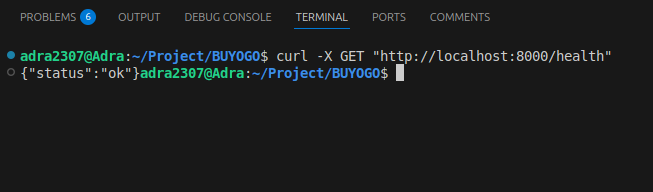
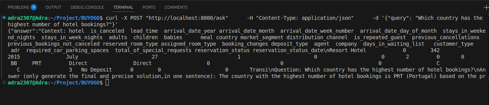

# RAG for Hotels - Dataset Analysis & Implementation

## 📌 Project Overview
This project analyzes and implements a machine learning pipeline using the dataset provided in `buyogo-assignment(4).ipynb`. The goal is to extract insights, preprocess data, and develop a model to achieve specific objectives.

## 📊 Dataset Analysis
The dataset contains structured data related to hotel bookings. Key aspects of the analysis include:

- **Exploratory Data Analysis (EDA)**: Understanding distributions, correlations, and missing values.
- **Feature Engineering**: Creating new features to enhance model performance.
- **Handling Missing Data**: Strategies like imputation or removal.
- **Data Normalization**: Scaling numerical features for optimal model training.

_📌 Analysis details can be found in `buyogo-assignment(4).ipynb`_

## 🏗️ FAISS and LLM Implementation

### 🔹 FAISS Index and Retrieval
The FAISS index is used for efficient vector-based retrieval. We load the index and use it with a pre-trained embedding model (`sentence-transformers/all-MiniLM-L6-v2`) to fetch relevant documents.

### 🔹 LLM Integration
The implementation integrates a retrieval-augmented generation (RAG) model using Hugging Face’s `Mistral-7B-Instruct-v0.2`. The API is queried to generate concise responses based on retrieved documents.

📌 Code implementation available in `HotelBooking_RAG.ipynb`  
📌 The notebook also contains a **comparison of test queries, correct answers, and model-generated responses** to evaluate performance.


## 🖥️ RAG Model Implementation Using Docker
The RAG model is deployed using `FastAPI` and `Docker`. Below is the implementation:

```python
import requests
import os
from fastapi import FastAPI
from langchain_community.vectorstores import FAISS
from langchain.embeddings import HuggingFaceEmbeddings
from pydantic import BaseModel

app = FastAPI()

# 🔹 Load FAISS index
faiss_index_path = "faiss_index"
embedding_model = HuggingFaceEmbeddings(model_name="sentence-transformers/all-MiniLM-L6-v2")
vector_store = FAISS.load_local(faiss_index_path, embeddings=embedding_model, allow_dangerous_deserialization=True)
retriever = vector_store.as_retriever()

# 🔹 Hugging Face API Details
API_URL = "https://api-inference.huggingface.co/models/mistralai/Mistral-7B-Instruct-v0.2"
HF_TOKEN = os.getenv("HUGGINGFACE_TOKEN", "YOUR_HUGGINGFACE_TOKEN")
HEADERS = {"Authorization": f"Bearer {HF_TOKEN}"}

def query_huggingface_api(prompt):
    """Sends a request to the Hugging Face API and handles errors."""
    payload = {
        "inputs": prompt,
        "parameters": {
            "max_new_tokens": 50,
            "temperature": 0.5,
            "top_p": 0.8
        }
    }
    try:
        response = requests.post(API_URL, headers=HEADERS, json=payload)
        response.raise_for_status()
        result = response.json()
        if isinstance(result, list) and "generated_text" in result[0]:
            return result[0]["generated_text"].strip()
        return "Unexpected response format."
    except requests.exceptions.RequestException as e:
        return f"API Error: {str(e)}"

@app.get("/health")
def health_check():
    return {"status": "ok"}

class QueryRequest(BaseModel):
    query: str

@app.post("/ask")
def ask_question(request: QueryRequest):
    query = request.query
    retrieved_docs = retriever.get_relevant_documents(query)
    if not retrieved_docs:
        response = "No relevant information found in the database."
    else:
        context = " ".join([doc.page_content for doc in retrieved_docs[:1]])[:1000]
        prompt = f"Context: {context}\nQuestion: {query}\nAnswer (only generate the final and precise solution, in one sentence):"
        response = query_huggingface_api(prompt)
    return {"answer": response}

if __name__ == "__main__":
    import uvicorn
    uvicorn.run(app, host="0.0.0.0", port=8000)
```

### 📦 Dockerfile for Deployment
```dockerfile
FROM python:3.9

WORKDIR /app

# Install dependencies
RUN apt-get update && apt-get install -y git python3-pip libstdc++6 && \
    rm -rf /var/lib/apt/lists/*

# Upgrade pip and install requirements
RUN pip install --no-cache-dir --upgrade pip

COPY requirements.txt requirements.txt
RUN pip install --no-cache-dir -r requirements.txt

# Copy application files
COPY . .

EXPOSE 8000

CMD ["uvicorn", "main:app", "--host", "0.0.0.0", "--port", "8000"]
```

## 🚀 How to Run
1. Build the Docker container:
   ```bash
   docker build -t buyogo-rag .
   ```
2. Run the container:
   ```bash
   docker run -p 8000:8000 buyogo-rag
   ```
3. Check the API health:
   ```bash
   curl http://localhost:8000/health
   ```
   

4. Send a query:
   ```bash
   curl -X POST "http://localhost:8000/ask" -H "Content-Type: application/json" -d '{"query": "Your question here"}'
   ```
   

📈 Challenges & Model Selection

During the implementation, several challenges were encountered:

Efficient Retrieval: Ensuring that the FAISS index provides accurate and fast retrieval of relevant documents.

LLM Response Quality: Selecting Mistral-7B-Instruct-v0.2 due to its balance of performance, cost, and ability to generate concise answers.

Fine-Tuning: Optimizing query generation and response refinement for better accuracy.

Scalability: Deploying the model efficiently with Docker to ensure smooth API responses in production environments.

The decision to use FAISS and Mistral-7B was based on their strong retrieval capabilities and cost-effective yet powerful language model performance.

---
**📌 Author:** Romit Addagatla
**📧 Contact:** addromit2307@gmail.com
